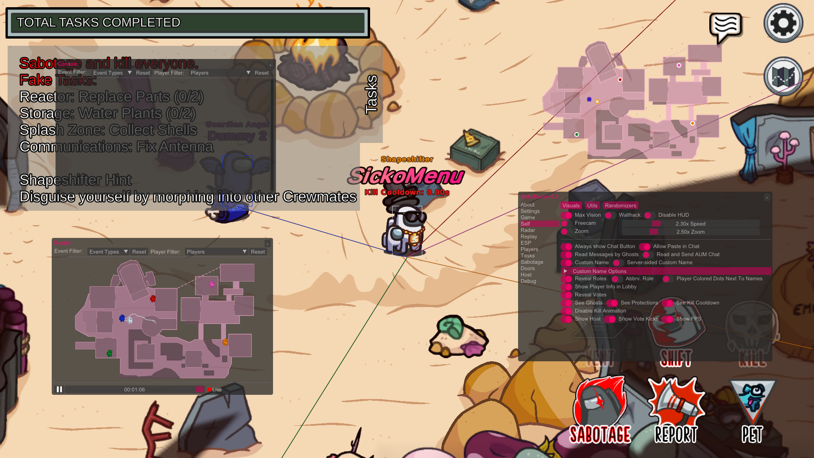

# 👺 SickoMenu v3.4
A highly sophisticated cheat menu for Among Us based on AmongUsMenu which promises more features and regular updates.

Join our very own [Discord](https://dsc.gg/sickos) server for support, bug reports, and sneak peeks!

## ⚠️ Disclaimer
This project is intended for Educational Use only. I do not condone this software being used to gain an advantage against other people. This project is aimed to make Innersloth's anticheat better. Use at your own risk. If you get banned from playing entirely or from a lobby, I (g0aty) am not responsible.

## ⚙️ Features
A huge collection of various utilities and cheats such as
- Generate a brand new guest account every time the game is launched
- Allow other players to no-clip
- Ban other players without hosting
- Fake Roles
- NoClip
- Move in Vents
- Zoom Out
- Confuser
- See Ghosts and Chat
- Kill players even if you're not an impostor
- Better AUM Chat (Type in regular chat: "/aum [insert message here]")
- And much more! Check out the full list of features [here](https://github.com/g0aty/SickoMenu/blob/main/FEATURES.md)!

## 📸 Screenshot

   

## 👌 Supported Versions
- ✅ Steam (Supported)
- ✅ Epic Games (Supported)
- ✅ itch.io (Supported)
- ❓ Cracked (works occasionally, I don't condone it)
- ❌ Microsoft Store (Not Supported)
- ❌ iOS/iPadOS/Android (Not Supported)
- ❌ Switch/Xbox/Playstation (Not Supported)

## ⬇️ Download & Install
### For Windows
You can find the latest release here: [Download](https://github.com/g0aty/SickoMenu/releases/latest).
Either inject "SickoMenu.dll" with a reliable injector or put "version.dll" in your Among Us directory (the folder containing "Among Us.exe").

### For Proton (Version Proxy Only)
First you will need protontricks, you can install it with your packager of choice.

1. Make sure you are running Among Us under Proton  
   You can check by going to **Properties -> Compatibility**
3. Put version.dll into Among Us folder
4. Run `protontricks --gui`
5. Choose **Among Us**
6. Click on **Select the default wineprefix** and then **OK**
7. Click on **Run winecfg** and then **OK**
8. In the configuration window, click on **Libraries**
9. Type `version` into the **New override for library** input
10. Click **Add** and then **Apply**
11. SickoMenu should now work properly in the game

## ⌨️ Default Hotkeys
- Show Menu - DELETE
- Show Radar - INSERT
- Show Console - HOME
- Show Replay - END
- Repair Sabotage - PAGE DOWN (PgDn)
- NoClip - CTRL
- Panic / Disable SIckoMenu - PAUSE BREAK (Break)

## ⚒️ Compile (Configurations)
You can compile two different versions of the menu. Normal or Version Proxy. Steps to compile can be found [here](https://docs.google.com/document/d/1bdXyasr7suassff_or3ywPyItGkjhlTfbBJtvaJ6udQ/edit?usp=sharing).

### Normal (SickoMenu.dll)
Inject it with any injector you have.

- Debug (With Debug Information and can be attached to process)
- Release (Optimized with all information stripped)

### Version Proxy (version.dll)
Will automatically be loaded by the Game itself if the dll is in the game directory.

- Debug_Version (With Debug Information and can be attached to process)
- Release_Version (Optimized with all information stripped)

## 🙏 Special Thanks
* The BitCrackers team for creating [AmongUsMenu](https://github.com/BitCrackers/AmongUsMenu)
* [KulaGGin](https://github.com/KulaGGin) (Helped with some ImGui code for replay system)
* [tomsa000](https://github.com/tomsa000) (Helped with fixing memory leaks and smart pointers)
* [cddjr](https://github.com/cddjr) (Helped in updating to the Fungle map, saved a lot of my time)
* Everyone else who contributed to the code and I couldn't list here. Thank you!

## 💁 Contributing
1. Fork it [here](<https://github.com/g0aty/SickoMenu/fork>)
2. Create your feature branch (`git checkout -b feature/fooBar`)
3. Commit your changes (`git commit -am 'Add some fooBar'`)
4. Push to the branch (`git push origin feature/fooBar`)
5. Create a new Pull Request