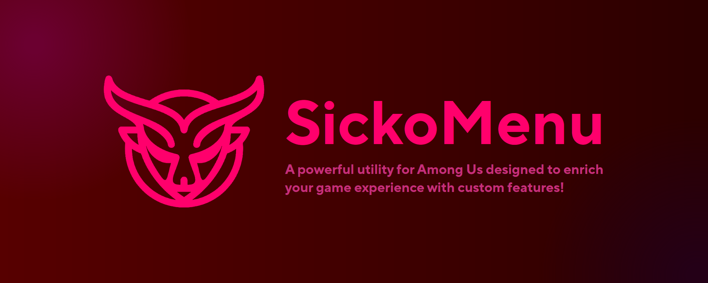

<p align="center">
   
  </p>

<h1 align="center">👺 SickoMenu v4.4</h1>
A powerful utility for Among Us designed to enrich your game experience with custom features!

**Intended for educational and experimental use only.**

Join our very own Discord server for support, bug reports, and sneak peeks!  
### Vanity Invite: https://discord.gg/sickos  
### Permanent invite: https://dsc.gg/sickos 
---

## ⚠️ Disclaimer
This project is maintained by **g0aty**, with contributions from other developers.  
It is intended **solely for educational and non-commercial research purposes**, such as exploring game mechanics and studying anti-cheat systems.

This project is **not affiliated with, endorsed, or supported by Innersloth LLC** in any capacity.

By downloading, installing, or using this software, you acknowledge and agree that:

- You are solely responsible for how you use it.
- You will not use it to violate Innersloth’s [Terms of Service](https://www.innersloth.com/terms/) or disrupt public gameplay.
- The developers, including **g0aty** and all contributors, **assume no responsibility or liability** for:
  - Any direct or indirect consequences of misuse,
  - Violations of third-party rules or terms,
  - Game bans, data loss, or damage caused by use of this utility.

---

**Legal Notice:**  
Portions of the game referenced or interacted with may be intellectual property of Innersloth LLC. © Innersloth LLC.  
This project is designed to comply with their [Modding Policy](https://www.innersloth.com/policies/) for private and non-malicious experimentation.

> ⚠️ Use responsibly. This software is provided "as is", **without any warranties** or guarantees of safety, support, or fitness for purpose.

---

## 🛑 Ethical Use Protocol
**By using SickoMenu, you agree to:**
1. **Use exclusively in private lobbies** with consenting players.
2. **Never exploit features in public matches** or to harass others.
3. **Respect Innersloth's Terms of Service** and the integrity of the game.
4. **Immediately disable the mod** (`PAUSE BREAK` hotkey) if joining public lobbies accidentally.

> 🚫 Misuse may result in punitive actions on your Among Us account, including permanent bans. **We do not condone cheating.**  
> Report unethical usage in our [Discord](https://discord.gg/sickos).

---

## ⚙️ Features
A huge amount of features!!
- NoClip (`CTRL`)  
- Ghost Visibility  
- Confuser (May disrupt gameplay)  

**Cosmetic/UI Enhancements:**  
- Zoom Out  
- SickoMenu Chat (`/sc [message]`)  

**Full Feature List:** [FEATURES.md](https://github.com/g0aty/SickoMenu/blob/main/FEATURES.md)  

> 🔸 Features marked with **"!"** may impact game balance. Always obtain lobby consent

---

## 📸 Screenshot
<p align="center">
   
</p>

## 👌 Supported Versions
- ✅ Steam (Supported)
- ✅ Epic Games (Supported)
- ✅ itch.io (Supported)
- ❓ Cracked (works occasionally, I don't condone it)
- ❌ Microsoft Store (Not Supported)
- ❌ iOS/iPadOS/Android (Not Supported)
- ❌ Switch/Xbox/Playstation (Not Supported)

## ⬇️ Download & Install
### For Windows
You can find the latest release [here](https://github.com/g0aty/SickoMenu/releases/latest).
Either inject `SickoMenu.dll` with a reliable injector or put `version.dll` in your Among Us directory (the folder containing `Among Us.exe`).

### For Proton (Version Proxy Only)
First you will need [protontricks](https://github.com/Matoking/protontricks), you can install it with your packager of choice.

1. Make sure you are running Among Us under Proton. 
   On Steam you can check this by going to **Properties -> Compatibility**
2. Put version.dll into your Among Us directory (the folder containing `Among Us.exe`).
3. Run `protontricks --gui`
4. Choose **Among Us**
5. Click on **Select the default wineprefix** and then **OK**
6. Click on **Run winecfg** and then **OK**
7. In the configuration window, click on **Libraries**
8. Enter `version` into the **New override for library** input field
9. Click **Add** and then **Apply**
10. SickoMenu should now work properly in the game

### For macOS (Version Proxy Only)

> [!NOTE]
> This method uses CrossOver. If you have ANY other ways to use this with other software, refer to the contributing section!
> 
**Method 1:**

1. Install a bottle of CrossOver, install Steam in it and install Among Us.
2. Open the C drive inside of CrossOver (there should be a button). Quit CrossOver. A Finder window will open.
3. Go to `Program Files (x86)/Steam/steamapps/common/Among Us/` and put the `version.dll` into it. Then reopen CrossOver.
4. Go to the **Configure Wine** panel, go to **Libraries**, open the menu below **New Replacement for:** and search for `version`.
5. Select it and click **Add**, then **Apply** and **OK**.
6. Start Among Us and press **Command+⌦** to show SickoMenu.

**Method 2:**

1. Download from [PlayOnMac](https://www.playonmac.com) and install it.
2. Open PlayOnMac and click **Install**.
   - Search for "Among Us" (even if not listed) and select **Install a non-listed program**.
   - Name the virtual drive (e.g., "Among Us Modded") and ensure it’s set to **32-bit architecture**.
3. Download the Steam installer from [store.steampowered.com](https://store.steampowered.com/about/).
   - In PlayOnMac’s installation wizard, select **Install components directly** > **Steam**.
   - Follow prompts to install Steam in the virtual drive.
4. Launch Steam from PlayOnMac, log in, and install Among Us.
5. Add SickoMenu’s `version.dll`
   - Right-click your virtual drive in PlayOnMac > **Open virtual drive’s directory**.
   - Navigate to:  
     `drive_c/Program Files (x86)/Steam/steamapps/common/Among Us`  
   - Place the `version.dll` file here.
6.  In PlayOnMac, select your virtual drive > **Configure** > **Wine** > **Libraries**.
   - Add `version` to the overrides and set it to **Native (Windows)**.
7.Run Among Us through Steam in PlayOnMac. Use the hotkey **Command + Delete** to toggle the mod menu.

**Method 3: (recommended)**

1. Open **Terminal** and install Wine via Homebrew.
   ```bash
   /bin/bash -c "$(curl -fsSL https://raw.githubusercontent.com/Homebrew/install/HEAD/install.sh)"
   brew install --cask wine-stable
   ```  
2. In Terminal, create a dedicated Wine prefix for Among Us:  
   ```bash
   mkdir -p ~/AmongUsWine
   WINEPREFIX=~/AmongUsWine winecfg
   ```  
   - In the Wine Configuration window, set **Windows Version** to **Windows 10** and close.
3. Download the **Steam Installer** from [store.steampowered.com](https://store.steampowered.com/about/).  
4. Install Steam into your Wine prefix:  
   ```bash
   WINEPREFIX=~/AmongUsWine wine ~/Downloads/SteamSetup.exe
   ```  
5. Follow the installer prompts. Launch Steam from Terminal afterward:  
   ```bash
   WINEPREFIX=~/AmongUsWine wine ~/AmongUsWine/drive_c/Program\ Files\ \(x86\)/Steam/Steam.exe
   ```  
6. Log in to Steam and install **Among Us**.
7. Locate the Among Us folder:  
   - Open **Finder** > Go to **Go > Go to Folder** and paste:  
     `~/AmongUsWine/drive_c/Program Files (x86)/Steam/steamapps/common/Among Us`  
   - Drag the `version.dll` file into this fold.
8. In Terminal, run:  
   ```bash
   WINEPREFIX=~/AmongUsWine winecfg
   ```  
   - Go to the **Libraries** tab.  
   - Under **New override for library**, type `version`, click **Add**, then set it to **Native (Windows)**.  
   - Click **Apply** > **OK**.
9. Launch Steam from Terminal (as in Step 3.3).  
- Start Among Us from your Steam library.  
- Use **Command + Delete** to toggle SickoMenu in-game.

---
### **Note:**
**For Method 2:**
- macOS Catalina+ Users: macOS versions ≥10.15 lack 32-bit support, which may cause issues. Use **Wine-Staging** (via Homebrew) for better compatibility:
  ```bash
  brew install --cask wine-stable
  ```
  **For Method 3:**
- The bash in the first step will install Homebrew, if you don't have it on your os. I recommend this method for users comfortable with basic terminal commands.

## ⬇️ Downgrading Among Us (If needed)
- Since the latest update of Among Us 17.0.0 can't be spoofed due to new roles update , you can only use Sicko in 16.0.2 and spoof to 16.1.0 , here's the [link](https://textbin.net/rruqqrlgaw) for downgrading method or just read the text down here
**Note** : We already know about the update , please be patient for the menu to be updated. Don't make bug reports for this or i'll be closed instantly.
### For Steam :
**Method 1** (Not Recommended) : 
- Open Steam -> Library -> Among Us -> click the settings icon -> Properties -> Betas -> Public Betas, and launch the game from **Steam**!
**Method 2** : 
1. In a browser, open the Steam Console

steam://open/console

2. Type this command

download_depot 945360 945361 1602714909229311555

3. Go to the location it specifies when the depot download is complete:

Depot download complete : "C:\Program Files\Steam\steamapps\... (etc, yours maybe different , you can set it as the location you want)"

4. (Optional): Drag the contents of the files in the folder into a separate folder to keep

5 (Important): Add a text file named steam_appid.txt (make sure you have file extensions visible!) to the folder

6. Open it, and save it with the following text:
945360

7. Run Among Us from the EXE, do NOT run it from steam! Make sure steam is opened in the background. If you don't have steam_appid.txt in your AU folder , you'll get authentication error , same if you don't have steam opened in the background.

AU 16.0.0 should now be at that location!
Note: use a directory that does not need administrator privileges and is not in a cloud service like Onedrive, Steam messes itself up sometimes

## For Epic Games :
**Method :**
Use the EpicGamesDowngrader tool by whichtwix:
https://github.com/whichtwix/EpicGamesDowngrader
Refer to the readme for any issues you might have!
You may also follow this tutorial by Limehcik (It is in Russian, but it still helps with the installation!): https://www.youtube.com/watch?v=q4DFUfzd26g

## For Itch.io : Make sure you have an older copy of Among Us somewhere else, then install SickoMenu there!

---
## ⌨️ Default Hotkeys
- Show/Hide Menu - DELETE
- Show/Hide Radar - INSERT
- Show/Hide Console - HOME
- Show/Hide Replay - END
- Repair Sabotage - PAGE DOWN (PgDn)
- NoClip - CTRL
- Panic / Disable SickoMenu / Enable SickoMenu after disabling - PAUSE BREAK (Break)
## 🖊️ Changable Keybinds
- Show/Hide chat
- Read Ghost Messages (show ghost chat)
- Freecam
- Enable/Disable HUD (The button such as use/vent/kill)
- Zoom
- Auto Kill
- Reset Appearance
- Confuse Now
- Repair All Sabotages
- Close All Doors
- Close Current Room Door
- Complete All Tasks
**Note** : Only those features are changable in the Keybinds settings , it's not planned to add more right now (maybe in the future).

## ⚒️ Compile (Configurations)
You can compile two different versions of the menu. Normal or Version Proxy. Steps to compile can be found [here](https://docs.google.com/document/d/1bdXyasr7suassff_or3ywPyItGkjhlTfbBJtvaJ6udQ/edit?usp=sharing).

### Normal (SickoMenu.dll)
Inject it with any injector you have.

- Debug (With Debug Information and can be attached to process)
- Release (Optimized with all information stripped)

### Version Proxy (version.dll)
Will automatically be loaded by the Game itself if the dll is in the game directory.

- Debug_Version (With Debug Information and can be attached to process)
- Release_Version (Optimized with all information stripped)

## ❓ FAQ (Frequently Asked Questions) :
- The [link](https://textbin.net/frtqdcip4k) for SickoMenu FAQ is here.

## 🙏 Special Thanks
* The [BitCrackers](https://github.com/bitcrackers) team for creating [AmongUsMenu](https://github.com/BitCrackers/AmongUsMenu)
* [KulaGGin](https://github.com/KulaGGin) (Helped with some ImGui code for replay system)
* [tomsa000](https://github.com/tomsa000) (Helped with fixing memory leaks and smart pointers)
* [cddjr](https://github.com/cddjr) (Helped in updating to the Fungle map, saved a lot of my time)
* Everyone else who contributed to the code and I couldn't list here. Thank you!

## 💁 Contributing
1. Fork it [here](<https://github.com/g0aty/SickoMenu/fork>)
2. Create your feature branch (`git checkout -b feature/fooBar`)
3. Commit your changes (`git commit -am 'Add some fooBar'`)
4. Push to the branch (`git push origin feature/fooBar`)
5. Create a new Pull Request

## ✨ Inspiration
* [DarkModeAU](https://github.com/the-real-techiee/DarkModeAU) by [the-real-techiee](https://github.com/the-real-techiee/)
* [YuEzTools](https://github.com/Team-YuTeam/YuEzTools) by [Team-YuTeam](https://github.com/Team-YuTeam)
* [BetterAmongUs-Public](https://github.com/EnhancedNetwork/BetterAmongUs-Public) by [EnhancedNetwork](https://github.com/EnhancedNetwork/) ([D1GQ](https://github.com/D1GQ))
* [MalumMenu](https://github.com/scp222thj/MalumMenu) by [scp222thj](https://github.com/scp222thj)
