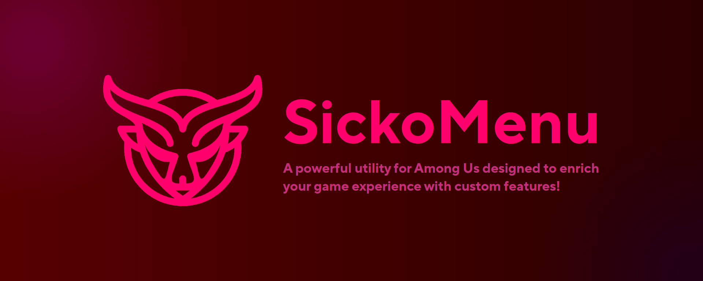
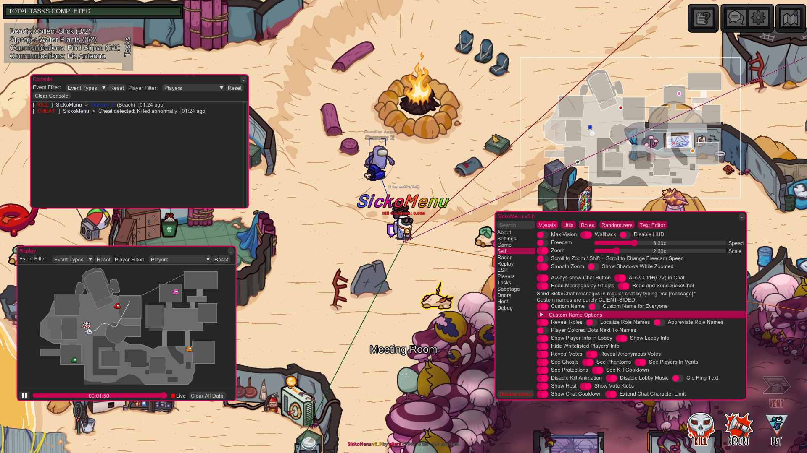

<p align="center">
   
  </p>

# <div align="center">
  
</div>

<p align="center">
  <a href="https://github.com/g0aty/SickoMenu/releases/latest"></a>
  <a href="https://github.com/g0aty/SickoMenu/stargazers"></a>
  <a href="https://github.com/g0aty/SickoMenu/network/members"></a>
  <a href=LICENSE></a>
  <a href="https://github.com/g0aty/SickoMenu/releases"></a>
  <a href="https://discord.gg/sickos"></a>
</p>

A powerful utility for Among Us designed to enrich your game experience with custom features!

**Intended for educational and experimental use only.**

Join our very own **Discord Server** for support, bug reports, and sneak peeks!
### Vanity Invite: https://discord.gg/sickos
### Permanent invite: https://dsc.gg/sickos

---

## 📋 Table of Contents
- [⚠️ Disclaimer](#%EF%B8%8F-disclaimer)
- [⁉️ Frequently Asked Questions](#%EF%B8%8F-frequently-asked-questions)
- [🛑 Ethical Use Protocol](#-ethical-use-protocol)
- [⚙️ Features](#%EF%B8%8F-features)
- [📸 Screenshot](#-screenshot)
- [👌 Supported Versions](#-supported-versions)
- [⬇️ Download & Install](#%EF%B8%8F-download--install)
  - [For Windows](#for-windows)
  - [For Proton](#for-linux-protonwine-version-proxy-only)
  - [For macOS](#for-macos-version-proxy-only)
- [⌨️ Default Hotkeys](#%EF%B8%8F-default-hotkeys)
- [⚒️ Building / Compilation](#%EF%B8%8F-building--compilation)
- [💁 Contributing](#-contributing)
- [✨ Inspiration](#-inspiration)
- [🙏 Special Thanks](#-special-thanks)

## ⚠️ Disclaimer
This project is maintained by **g0aty**, with contributions from other developers.  
It is intended **solely for educational and non-commercial research purposes**, such as exploring game mechanics and studying anti-cheat systems.

This project is **not affiliated with, endorsed, or supported by Innersloth LLC** in any capacity.

By downloading, installing, or using this software, you acknowledge and agree that:

- You are solely responsible for how you use it.
- You will not use it to violate Innersloth’s [Terms of Service](https://www.innersloth.com/terms-of-use-for-the-games/) or disrupt public gameplay.
- The developers, including **g0aty** and all contributors, **assume no responsibility or liability** for:
  - Any direct or indirect consequences of misuse,
  - Violations of third-party rules or terms,
  - Game bans, data loss, or damage caused by use of this utility.

---

**Legal Notice:**
Portions of the game referenced or interacted with may be intellectual property of Innersloth LLC. © Innersloth LLC.  
This project is designed to comply with their [Modding Policy](https://www.innersloth.com/among-us-mod-policy/) for private and non-malicious experimentation.

> ⚠️ Use responsibly. This software is provided "as is", **without any warranties** or guarantees of safety, support, or fitness for purpose.

---

## ⁉️ Frequently Asked Questions
Click [here](https://github.com/g0aty/SickoMenu/blob/main/FAQ.md) to read the list of FAQs!

## 🛑 Ethical Use Protocol
**By using SickoMenu, you agree to:**
1. **Use exclusively in private lobbies** with consenting players.
2. **Never exploit features in public matches** or to harass others.
3. **Respect Innersloth's Terms of Service** and the integrity of the game.
4. **Immediately disable the mod** (`PAUSE BREAK` hotkey) if joining public lobbies accidentally.

> 🚫 Misuse may result in punitive actions on your Among Us account, including permanent bans. **We do not condone cheating.**  
> Report unethical usage in our [Discord](https://discord.gg/sickos).

---

## ⚙️ Features
A huge amount of features!
- NoClip (`CTRL`)  
- Ghost Visibility  
- Confuser (May disrupt gameplay)  

**Miscellaneous Features:**
- Zoom Out
- Disable Kill Animation
- SickoChat (`/sc <message>`) 

**Full Feature List: [FEATURES.md](https://github.com/g0aty/SickoMenu/blob/main/FEATURES.md)**

> 🔸 Features marked with **"!"** may impact game balance. Always obtain lobby consent

## 📸 Screenshot
<p align="center">
   
</p>

## 👌 Supported Versions
- ✅ Steam (Supported)
- ✅ itch.io (Supported)
- 🟡 Epic Games (Supported - Experimental)
- 🟡 Microsoft Store/Xbox App (Windows) (Supported - Experimental)
- ❓ Cracked (works occasionally, I don't condone it)
- ❌ iOS/iPadOS/Android (Not Supported)
- ❌ Switch/Xbox/Playstation (Not Supported)

## ⬇️ Download & Install
### For Windows
You can find the latest release [here](https://github.com/g0aty/SickoMenu/releases/latest).
Either inject `SickoMenu.dll` with a reliable injector or put `version.dll` in your Among Us directory (the folder containing `Among Us.exe`). Make sure to use the correct DLL for your Among Us platform!

**Accessing the Among Us directory for supported platforms:**
- **🚂 Steam** Right-click **Among Us** in your Library → Click **Manage** → Click **Browse local files**.
- **🛖 itch.io** Go to wherever you normally execute **Among Us.exe**.
- **🛍️ Epic Games** Right-click **Among Us** in your Library → Click **Manage** → Click the folder icon in the **Installation** box.
- **🪟 Microsoft Store** Go to `C:\Program Files\WindowsApps\` and search for **Among Us.exe**, the location of it is the required folder.
- **❎ XBOX App** Right-click Among Us in your Library → Click **Manage** → Open the **FILES** tab → Click **BROWSE...** → Open the **Among Us** folder → Open the **Content** folder.
- **❌ Other Platforms** Unsupported!

### For Linux (Proton/Wine) (Version Proxy Only)

**Method 1: (Recommended)**

1. Place `version.dll` in your Among Us directory
2. Add `WINEDLLOVERRIDES="version=n,b" %command%` to your Among Us launch options. 
SickoMenu should now load!

**If you're facing issues - try Method 2:**

First, you'll need [protontricks](https://github.com/Matoking/protontricks). You can install it with your packager of choice.

1. Make sure you are running Among Us under Proton. 
   On Steam, you can check by going to **Properties -> Compatibility**
2. Put `version.dll` into your Among Us directory (the folder containing `Among Us.exe`).
3. Run `protontricks --gui`
4. Choose **Among Us**
5. Click on **Select the default wineprefix** and then **OK**
6. Click on **Run winecfg** and then **OK**
7. In the configuration window, click on **Libraries**
8. Enter `version` into the **New override for library** input field
9. Click **Add** and then **Apply**
10. SickoMenu should now work properly!

### For macOS (Version Proxy Only)

> [!NOTE]
> This method uses CrossOver. If you have ANY other ways to use this with other software, refer to the contributing section!

> [!TIP]
> The hotkey to trigger SickoMenu depends on your Mac model. There are 2 possible triggers: Command+Backspace **OR** Function+Backspace.

**Backspace corresponds to the ⌫ on your keyboard.**

**Method 1:**

1. Install a bottle of CrossOver, install Steam in it and install Among Us.
2. Open the C drive inside of CrossOver (there should be a button). Quit CrossOver. A Finder window will open.
3. Go to `Program Files (x86)/Steam/steamapps/common/Among Us/` and put the `version.dll` into it. Then reopen CrossOver.
4. Go to the **Configure Wine** panel, go to **Libraries**, open the menu below **New Replacement for:** and search for `version`.
5. Select it and click **Add**, then **Apply** and **OK**.
6. Start Among Us and press `Fn + Backspace` or `Command ⌘ + Backspace` to show/hide the menu, depending on mac your model.

**Method 2:**

1. Download from [PlayOnMac](https://www.playonmac.com) and install it.
2. Open PlayOnMac and click **Install**.
   - Search for "Among Us" (even if not listed) and select **Install a non-listed program**.
   - Name the virtual drive (e.g., "Among Us Modded") and ensure it’s set to **32-bit architecture**.
3. Download the Steam installer from [store.steampowered.com](https://store.steampowered.com/about/).
   - In PlayOnMac’s installation wizard, select **Install components directly** > **Steam**.
   - Follow prompts to install Steam in the virtual drive.
4. Launch Steam from PlayOnMac, log in, and install Among Us.
5. Add SickoMenu’s `version.dll`
   - Right-click your virtual drive in PlayOnMac > **Open virtual drive’s directory**.
   - Navigate to:  
     `drive_c/Program Files (x86)/Steam/steamapps/common/Among Us`  
   - Place the `version.dll` file here.
6.  In PlayOnMac, select your virtual drive > **Configure** > **Wine** > **Libraries**.
   - Add `version` to the overrides and set it to **Native (Windows)**.
7.Run Among Us through Steam in PlayOnMac. Use the hotkey `Fn + Backspace` or `Command ⌘ + Backspace` to show/hide the menu, depending on your mac model.

**Method 3: (recommended)**

1. Open **Terminal** and install Wine via Homebrew.
   ```bash
   /bin/bash -c "$(curl -fsSL https://raw.githubusercontent.com/Homebrew/install/HEAD/install.sh)"
   brew install --cask wine-stable
   ```  
2. In Terminal, create a dedicated Wine prefix for Among Us:  
   ```bash
   mkdir -p ~/AmongUsWine
   WINEPREFIX=~/AmongUsWine winecfg
   ```  
   - In the Wine Configuration window, set **Windows Version** to **Windows 10** and close.
3. Download the **Steam Installer** from [store.steampowered.com](https://store.steampowered.com/about/).  
4. Install Steam into your Wine prefix:  
   ```bash
   WINEPREFIX=~/AmongUsWine wine ~/Downloads/SteamSetup.exe
   ```  
5. Follow the installer prompts. Launch Steam from Terminal afterward:  
   ```bash
   WINEPREFIX=~/AmongUsWine wine ~/AmongUsWine/drive_c/Program\ Files\ \(x86\)/Steam/Steam.exe
   ```  
6. Log in to Steam and install **Among Us**.
7. Locate the Among Us folder:  
   - Open **Finder** > Go to **Go > Go to Folder** and paste:  
     `~/AmongUsWine/drive_c/Program Files (x86)/Steam/steamapps/common/Among Us`  
   - Drag the `version.dll` file into this folder.
8. In Terminal, run:  
   ```bash
   WINEPREFIX=~/AmongUsWine winecfg
   ```  
   - Go to the **Libraries** tab.  
   - Under **New override for library**, type `version`, click **Add**, then set it to **Native (Windows)**.  
   - Click **Apply** > **OK**.
9. Launch Steam from Terminal (as in Step 3.3).  
- Start Among Us from your Steam library.  
- Use `Command ⌘ + Backspace` or `Fn + Backspace` to show/hide the menu, depending on your mac model.

**Method 4: Whisky + Apple Game Porting Toolkit (Apple Silicon)**

> [!NOTE]
> This method uses **Whisky** with **Apple’s Game Porting Toolkit**.
> It is completely separate from CrossOver, PlayOnMac, and manual Wine prefixes.

> [!TIP]
> This method works best on **Apple Silicon (M1 / M2 / M3)** Macs running **macOS Ventura (13+)**.

1. Download and install Whisky from:
https://getwhisky.app
Drag Whisky into your Applications folder and open it.
2. Allow Whisky to install Wine and Apple Game Porting Toolkit when prompted.
Create a new bottle in Whisky:
Click + New Bottle.
Name it something like Among Us GPTK.
Set Windows Version to Windows 10.
Leave architecture at default (64-bit).
Create the bottle.
3. Install Steam inside the bottle:
Select your bottle and click Run Installer.
Download the Steam installer from
https://store.steampowered.com/about/
Select SteamSetup.exe and complete the installation.
Launch Steam from Whisky:
Log in to your Steam account.
Install Among Us normally through Steam.
Close Steam once the installation finishes.
4. Add SickoMenu’s version.dll:
In Whisky, select your bottle and click Open Bottle in Finder.
5. Navigate to:
```drive_c/Program Files (x86)/Steam/steamapps/common/Among Us```
Place the version.dll file into this folder.
6. Configure the DLL override:
With the bottle selected, open Bottle Settings.
Click Wine Configuration.
Go to the Libraries tab.
Under New override for library, type version.
Click Add, set it to Native (Windows).
Click Apply and OK.
7. Launch the game:
Start Steam from Whisky.
Launch Among Us from your Steam library. \
Use `Fn + Backspace` or `Command ⌘ + Backspace` to show/hide the menu, depending on your mac model.
⠀⠀⠀⠀⠀⠀⠀⠀\
**Note:** \
  **For Method 2:**
- For macOS Catalina+ Users: macOS versions ≥10.15 lack 32-bit support, which may cause issues. Use **Wine-Staging** (via Homebrew) for better compatibility:
  ```bash
  brew install --cask wine-stable
  ```
  **For Method 3:**
- The bash in the first step will install Homebrew, if you don't have it on your os. I recommend this method for users comfortable with basic terminal commands.
---

## ⌨️ Default Hotkeys

| Action                          | Key              |
|---------------------------------|------------------|
| Show/Hide Menu                  | `DELETE`         |
| Show/Hide Radar                 | `INSERT`         |
| Show/Hide Console               | `HOME`           |
| Show/Hide Replay                | `END`            |
| Repair Sabotage                 | `PAGE DOWN`      |
| NoClip                          | `CTRL`           |
| Panic or Disable SickoMenu      | `PAUSE BREAK`    |

Hotkeys can be customized in-game under **Settings → Keybinds**.

## ⚒️ Building / Compilation
You can compile two different versions of the menu. Normal or Version Proxy. Steps to compile can be found [here](https://docs.google.com/document/d/1bdXyasr7suassff_or3ywPyItGkjhlTfbBJtvaJ6udQ/edit?usp=sharing).

### Normal (SickoMenu.dll)
Inject it with any injector you have.

- Debug (With debug information and can be attached to process)
- Release (Optimized with all debug information stripped)

### Version Proxy (version.dll)
Will automatically be loaded by the Game itself if the dll is placed in the game directory.

- Debug_Version (With debug information and can be attached to process)
- Release_Version (Optimized with all debug information stripped)

## 🤝 Contributing

Contributions are welcome and appreciated!

1. Fork the repository [here](https://github.com/g0aty/SickoMenu/fork)
2. Create your feature branch:  
   ```bash
   git checkout -b feature/your-feature-name
   ```
4. Commit your changes:  
   ```bash
   git commit -am 'Add some feature'
   ```
5. Push to the branch:  
   ```bash
   git push origin feature/your-feature-name
   ```
6. Open a Pull Request

> [!TIP]
> - Keep your changes focused and well-described  
> - Documentation and README improvements are welcome as long as they have effort put in to them
> - For larger features or big changes, consider discussing them in the [Discord](https://discord.gg/sickos) first

## ✨ Inspiration
Inspiration from/credit to other mods has been mentioned in the source code. If you think we haven't given you credit for a feature, open an issue for it!

## 🙏 Special Thanks
* The [BitCrackers](https://github.com/BitCrackers) team for creating [AmongUsMenu](https://github.com/BitCrackers/AmongUsMenu)
* [KulaGGin](https://github.com/KulaGGin) (Helped with some ImGui code for replay system)
* [tomsa000](https://github.com/tomsa000) (Helped with fixing memory leaks and smart pointers)
* [cddjr](https://github.com/cddjr) (Helped in updating to the Fungle map, saved a lot of my time)
* Everyone else who contributed to the code and I couldn't list here. Thank you!
